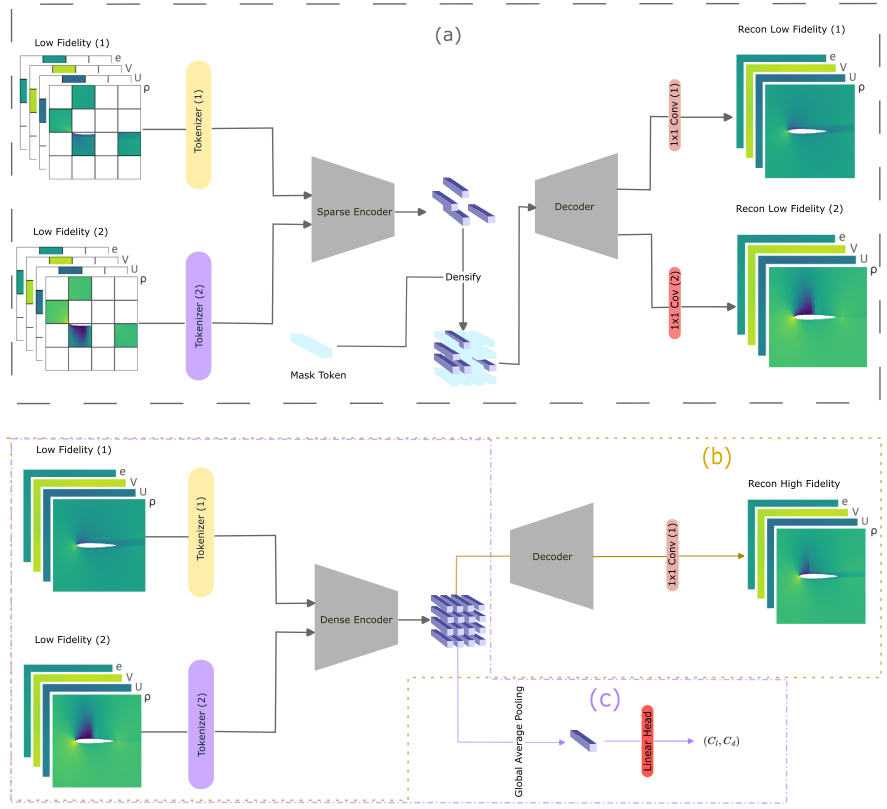

# Masked Pretrained CNN for Few-Shot Fluid Flow Super Fidelity

Code for Masked Pretrained CNN for Few-Shot Fluid Flow Super Fidelity. This repository contains training and evaluation scripts for CNN and Transformer baselines along with a burgers toy example.

Data for airfoil and wind turbine are available upon reasonable request.
## Few-shot super-fidelity example


*Few-shot extrapolation from several LF simulations to a single HF one. (a) An HF simulation and two LF ones for an airfoil at AoA = 4.9° and Mach = 0.7, that is, in the transonic regime with a shock wave. The HF simulation resolves all critical flow structures, including leading-edge compression, shock waves, and the wake. In contrast, the LF simulations, which we will refer to as LF(1) and LF(2), miss some of them. (b) Flow estimated from the LF simulations using different models. A CNN-based version of our model pre-trained using both LF simulations accurately recovers the shock waves. The transformer-based version partially recovers the shock waves but exhibits checkerboard artifacts. The CNN version pre-trained using only LF(1) fails to recover all shock waves, while not using pre-training at all does even worse.*

## Model overview


*Masked pre-training and fine-tuning using a convolutional neural net. (a) Masked pre-training with a CNN encoder using sparse convolutions over unmasked regions only, preserving mask patterns and improving efficiency. (b) Finetuning for field-to-field super-fidelity prediction: the linear prediction head is appended to the pre-trained decoder to map low-fidelity inputs to high-fidelity fields. (c) Scalar regression fine-tuning: the final CNN feature map of the pretrained encoder is pooled and passed through the prediction head.*

Data for airfoil and wind turbine are available upon reasonable request.

## Repository layout
- `pretrain/mae`: MAE-style pretraining on multi-fidelity PDE data.
- `finetune/cnn`: U-Net finetuning and evaluation.
- `finetune/transformer`: Transformer finetuning and evaluation.
- `pretrain/SparK`: SparK pretraining code.
- `results.ipynb`: Result visualization notebook.

## Setup
1. Create a Python environment (Python 3.9+ recommended).
2. Install dependencies:

```bash
pip install -r requirements.txt
```

If you need a specific PyTorch build (CUDA vs CPU), follow the official PyTorch install instructions before installing the rest of the requirements.

## Data
[Data and weights for the Burgers toy example](https://drive.google.com/drive/folders/1oXt1d7E1_4LRGSldpJfoDqlSJLpEhnnd?usp=sharing)

The Burgers toy example expects NumPy arrays on disk with filenames such as:
- `<id>_LF.npy`
- `<id>_HF.npy`
- `<id>_param.npy` (when required)

The configs in this repo use paths prefixed with `multi-fidelity-mask-pretrained-cnn`. Update those paths to your local checkout before running.

## Pretraining (MAE)
```bash
python pretrain/mae/pretrain.py --config pretrain/mae/burgers.yaml
```

## Finetuning (CNN)
Train:
```bash
python finetune/cnn/train.py --config finetune/cnn/configs.yaml
```

Evaluate:
```bash
python finetune/cnn/eval.py --config finetune/cnn/eval.yaml
```

## Finetuning (Transformer)
Train:
```bash
python finetune/transformer/train.py --config finetune/transformer/configs.yaml
```

Evaluate:
```bash
python finetune/transformer/eval.py --config finetune/transformer/eval.yaml
```

